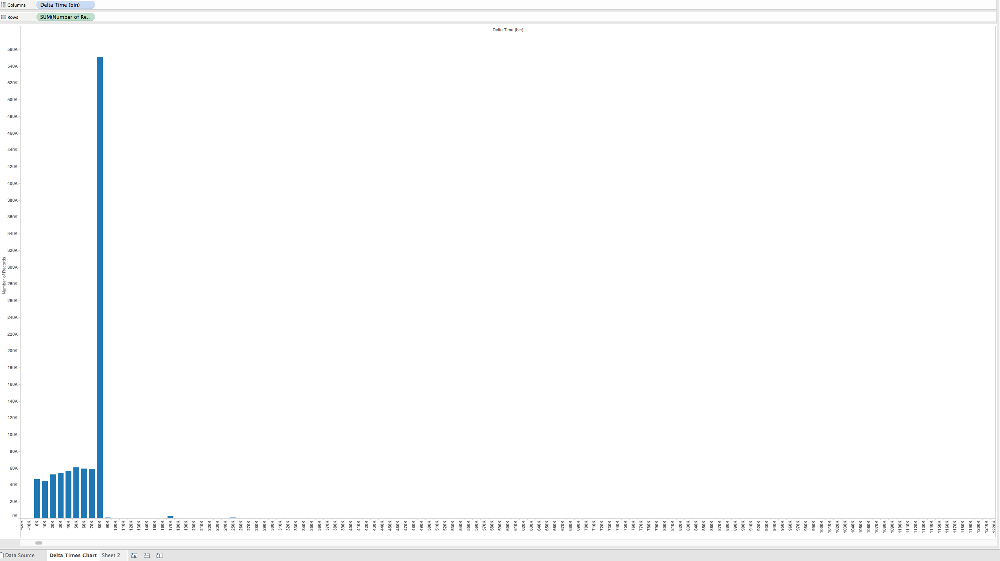

# NetApp

Brian McKean, a senior engineer at NetApp, gave a talk about his company in class.
He shared a data problem for our class to help solve.

# Tool
Tableau

# Authors

This report is prepared by
* [Karen Blakemore](link to github account)
* [Mingqi Liew](link to github account)
* [Matt Schroeder](link to github account)

# Find the Standard Deviation and Average of Delta Time 

https://public.tableau.com/profile/publish/Bigdata_Book/Sheet1#!/publish-confirm

In the chartabove, we see the population deviation of the population in the top, while the average in the bottom

# What percentage of the data points have time deltas of one day?

In the chart, above, the time deltas have been grouped into bins of 10,000 second increments. The number of deltas in the 80K-90K bin, which is approximately one day is 551,124. With a total of 1,070,436 lines in the .csv file, the percent of time deltas that are one day in length is 51.5% 

# Is there a correlation between Firmware Version and Time Deltas?

The chart above shows the distribution of delta times in 10,000 second increments over the firmware versions. Firmware version 7.86.38.30 shows a distinct pattern of delta times that are less than 1 day (80K bin).

# Further Analysis

Our team determines the following questions are too complex for Tableau and
require custom scripts to be written.

* Find out the percentage of error( any delta greater than a day) of B and A, and calculate the between 84600 to the largest possible number, 
what is the highest frequency of delta time that repeated in B, A and Total Controller.
* he development of Time Maps might be to complex for Tableau. Time Maps could be used to graph observations based on their time difference from the previous observation (x-axis) and the next observation (y-axis). We already have the x-axis values. These are the Delta Times. We would need to calculate the y-axis values which are the deltas between the current Observation Time and the next for a particular system.

